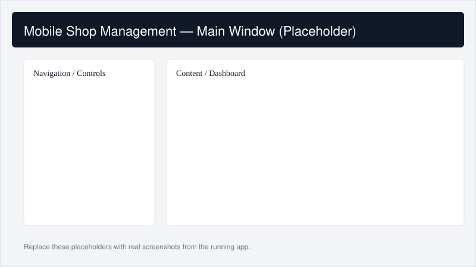
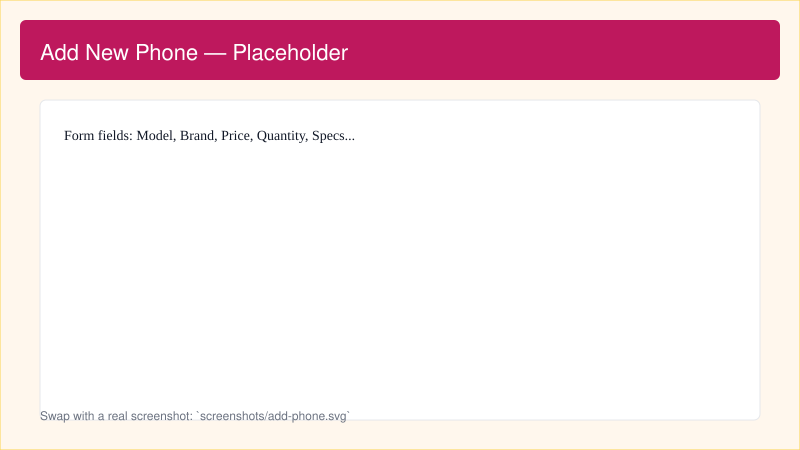

# Mobile Shop Management System

An inventory and sales management Windows Forms application for retail mobile phone shops. This repository contains the full Visual Studio solutions, SQL schema/scripts, and source code for the desktop application used to manage phones, customers, sales, and stock.

---

## Table of contents

- [Project overview](#project-overview)
- [Key features](#key-features)
- [Tech stack & tools](#tech-stack--tools)
- [Getting started](#getting-started)
	- [Requirements](#requirements)
	- [Database setup](#database-setup)
	- [Build and run (Windows)](#build-and-run-windows)
- [Project structure](#project-structure)
- [Contributing](#contributing)
- [License](#license)
- [Contact](#contact)

---

## Project overview

The Mobile Shop Management System is a desktop application (Windows Forms) designed to help small retail shops manage phone inventory, customer records, sales transactions, and stock levels. It includes a SQL Server database project and SQL scripts to create and populate the necessary tables.

The app is organized as a Visual Studio solution with user controls for commonly used workflows (add phone, manage customers, view customer records, delete phone records, stock management, and login).

## Screenshots

The repository now includes placeholder screenshots in the `screenshots/` folder. Replace them with real captures from the running app when available.

| Main window | Add new phone | Sales entry |
| --- | --- | --- |
|  |  |  |

## Key features

- Phone inventory management (add, edit, delete phone records)
- Customer management and lookup
- Sales entry and sale details (per-transaction line items)
- Stock / inventory tracking and alerts
- Simple login/user control flow for access to app sections

## Tech stack & tools

- Language: C#
- Platform: .NET 8 (Windows-specific — Windows Forms)
- Development: Visual Studio / MSBuild
- Database: SQL Server (SQL scripts and a .sqlproj for the database project are included)

## Getting started

### Requirements

- Windows 10/11 (or a Windows environment) — the UI is Windows Forms and requires Windows.
- .NET 8 SDK (matching the project's target framework)
- Visual Studio 2022/2023 (recommended) with .NET Desktop Development workload
- SQL Server or SQL Server Express to host the database

> Note: The repository contains a Visual Studio database project (`MobileShopManagement/`) and multiple SQL scripts under the root `MobileShopMangementSystem/` folder. The application is not cross-platform.

### Database setup

1. Open your SQL Server instance (SSMS or Visual Studio Database project).
2. Run the SQL scripts in `MobileShopMangementSystem/` (files beginning with `dbo.`) to create the schema and any initial data, or open the `MobileShopManagement/` database project and publish it to your SQL Server instance.

Files to check for schema and sample data:

- `MobileShopMangementSystem/dbo.Phones 1.sql`
- `MobileShopMangementSystem/dbo.Sales 1.sql`
- `MobileShopMangementSystem/dbo.SaleDetails 1.sql`
- `MobileShopMangementSystem/dbo.Employee 1.sql`

Adjust connection strings in the application (if any) to point to your SQL Server database before launching.

### Build and run (Windows)

1. Open the solution: `MobileShopMangementSystem/MobileShopMangementSystem.sln` in Visual Studio.
2. Restore NuGet packages (Visual Studio does this automatically on first build).
3. Build the solution.
4. Run the project (Debug or Release). The application launches as a Windows desktop app.

You can also build from the command line on Windows using:

```bash
dotnet build MobileShopMangementSystem/MobileShopMangementSystem.sln
```

But running the built Windows Forms app normally requires a Windows host.

## Project structure (high level)

- `MobileShopMangementSystem/` — Windows Forms application solution and source code
	- `AllUserControl/` — user control components such as `UC_AddNewPhone`, `UC_Customer`, `UC_CustomerRecords`, `UC_DeletePhoneRecord`, `UC_Login`, and `UC_Stock`
	- `Form1.cs`, `Program.cs`, and `function.cs` — application entry and helper logic
- `MobileShopManagement/` — Visual Studio database project (`.sqlproj`) and model files
- Root SQL scripts: `dbo.*.sql` — DDL/DML scripts to create tables and data

## Contributing

Contributions are welcome. Suggested workflow:

1. Fork the repository.
2. Create a feature branch for your change.
3. Test your changes locally (build + run the app, update database as needed).
4. Submit a pull request describing the change.

If you plan to make UI or database changes, include migration or SQL scripts so other developers can sync their local databases.

## License

This project is provided under the terms in the `LICENSE` file in this repository.

## Contact

If you have questions or want to propose improvements, open an issue or a pull request on GitHub.

---

If you'd like, I can:

- add screenshots or example data
- include explicit connection-string instructions
- add a sample export of the database to speed setup

Tell me which additions you'd like and I will update the README accordingly.
